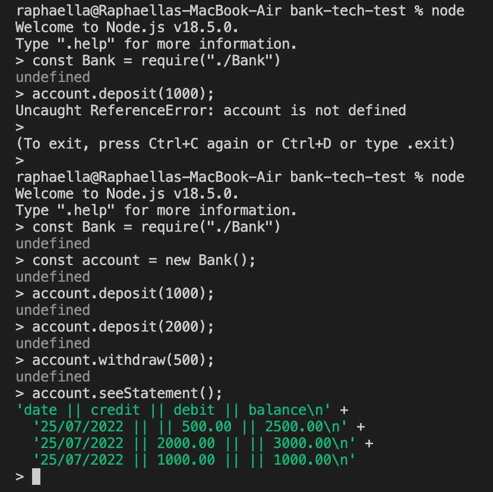

# bank-tech-test

## Setup

1. Install Node Version Manager (NVM)
   ```
   brew install nvm
   ```
   Then follow the instructions to update your `~/.bash_profile`.
2. Open a new terminal
3. Install the latest version of [Node.js](https://nodejs.org/en/),   currently `18.1.0`.
   ```
   nvm install 18
   ```
4. Install Node.js dependencies
   ```
   npm install
   ```

### Test

- Run all tests
  ```
  jest
  ```
- See test coverage
  ```
  jest --coverage
  ```

## Approach

I decided to start by developing the deposit function, 
  - increasing the balance by a given amount
  - storing the amount increased by
  - storing the balance after deposit
  - storing the date of the deposit

Next, I moved onto the withdrawal function,
  - decreasing the balance by a given amount
  - not allowing withdrawal of money not in the account
  - storing the amount decreased by
  - storing the balance after withdrawal
  - storing the date of the withdrawal

Lastly, I ensured the format of the statement was correct per the given spec.

## screenshot of app


